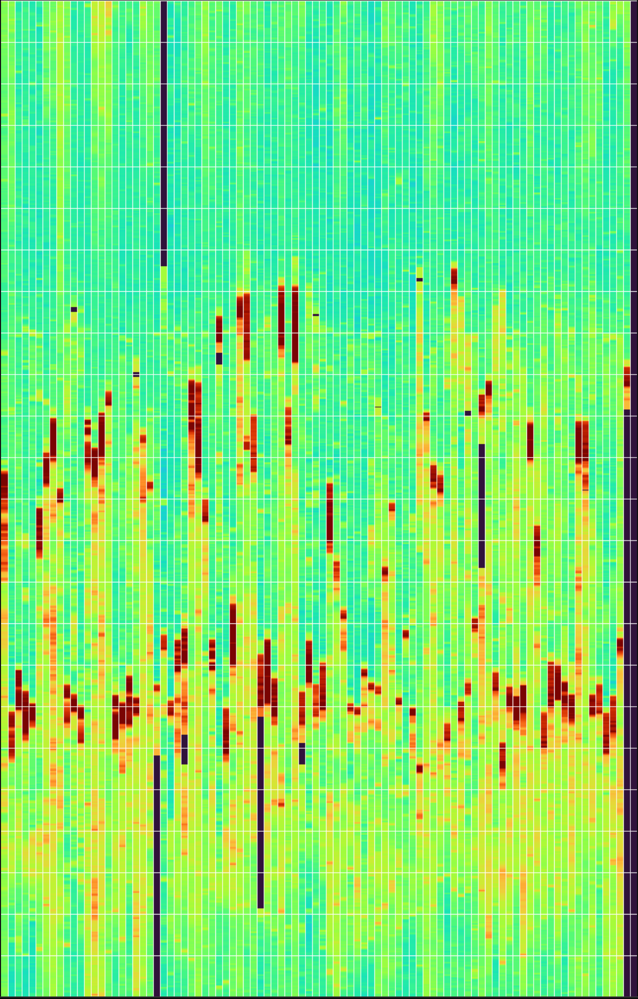
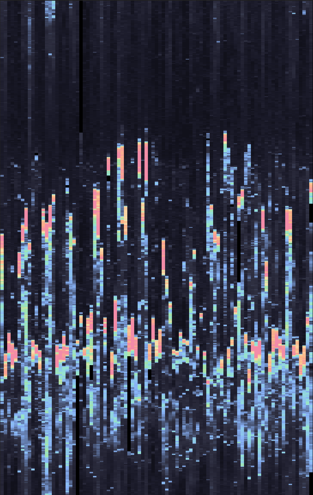

<p align="center">
  
  
</p>


# 📊 HR-Heatmap  
### Daily heart-rate heatmap generator powered by Garmin Connect  

---

## 🌟 Overview

**HR-Heatmap** automatically downloads your heart-rate history from Garmin Connect, transforms it into a 1440×92 minute-resolution table, and renders a beautiful heatmap image daily.

It runs entirely **locally**, and exposes a simple `<ip>:<port>/heatmap.png` endpoint ideal for dashboards like **Glance**, **Home Assistant**, or any image widget.

---

## ✨ Features

- **Automated daily data pull** from Garmin Connect Pyton module
- **1440 × 92** minute/day matrix with interpolation  
- **High-quality heatmap renderer** (custom colormap, gridlines, timezone support)  
- **FastAPI endpoint** serving the image locally  
- **Daily scheduler** regenerates the image at a configurable time   
- **Fully Dockerized**  
- **Plug-and-play support for Glance dashboard**

---

## 🔒 Privacy
 
Your Garmin credentials and env variables are stored only in a local `.env` file. 

---

## 📁 Project Structure

```
hr-heatmap/
│
├── app/
│   ├── main.py               # FastAPI app + HTTP server
│   ├── orchestrator.py       # Daily scheduler + pipeline controller
│   ├── garmin_client.py      # Garmin Connect ingestion
│   ├── hr_ingest.py          # Timestamp → minute vector processing
│   ├── pivot_builder.py      # 1440×92 table generator
│   ├── heatmap_render.py     # PNG creation
│   └── config.py             # Environment + settings
│
├── data/
│   ├── cache/                # Raw Garmin JSON + session cookies
│   └── output/               # Generated CSV + PNG
│
├── docker-compose.yml
├── Dockerfile
├── .env.example
└── README.md
```

---

## 🚀 Quick Start

### 1. Clone the repo

```bash
git clone https://github.com/seanap/hr-heatmap.git
cd hr-heatmap
cp .env.example .env
nano .env
```

### 2. Create your `.env`

Edit `.env`:

```env
GARMIN_USER=your-email@example.com
GARMIN_PASS=your-garmin-password
TIMEZONE=America/New_York
TRAILING_DAYS=92
RUN_HOUR_UTC=4
```

### 3. Launch

```bash
docker compose up -d
```

### 4. View your heatmap

```
http://<your-server-ip>:8246/heatmap.png
```

Status:

```
http://<your-server-ip>:8246/status
```

---

## 🎛 Glance Integration

Example widget:

```yaml
- type: html
    title: Heart rate heatmap
    source: |
    
```

---

## 🔄 Forcing a Re-Run

Sometimes you want to rebuild the entire 92-day heatmap immediately (e.g., after fixing code, tweaking settings, or updating credentials).

### Option A — Call the API:

```
http://<your-server-ip>:8246/force-rebuild
```

You will get:

```json
{"status":"ok","message":"Pipeline forced to run now"}
```

### Option B — Restart the container

```bash
docker restart hr-heatmap
```

---

## ⚙ Configuration Options

| Variable | Description | Default |
|---------|-------------|---------|
| GARMIN_USER | Garmin Connect username | required |
| GARMIN_PASS | Garmin Connect password | required |
| TIMEZONE | Local timezone | UTC |
| TRAILING_DAYS | Days in the heatmap | 92 |
| RUN_HOUR_UTC | Scheduler run time | 4 |
| COLORMAP_NAME | Matplotlib colormap | turbo, catppuccin-mocha |
| IMAGE_WIDTH | PNG width | 920 |
| IMAGE_HEIGHT | PNG height | 1440 |
| DRAW_HOUR_LINES | Horizontal gridlines | true |
| DRAW_DAY_LINES | Vertical gridlines | true |

---

## 🧩 How It Works

1. Logs into Garmin  
2. Fetches HR samples for the last N days  
3. Converts timestamps → local timezone  
4. Aggregates into **minute-of-day** buckets  
5. Interpolates gaps ≤ 10 minutes  
6. Builds a 1440×92 pivot table  
7. Renders a heatmap PNG  
8. Serves it over HTTP  
9. Scheduler regenerates daily

---

## 💗 Acknowledgments

- Inspired by original HR heatmap scripts shared online by Reddit u/Salt-Cress-7645
- https://www.reddit.com/r/Garmin/comments/1oxre10/comment/noza21l/?utm_source=share&utm_medium=web3x&utm_name=web3xcss&utm_term=1& 
- ChatGPT 5.1 Extended


